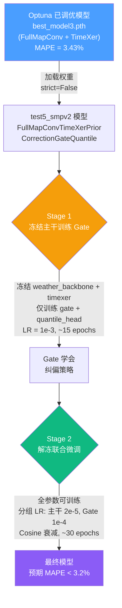
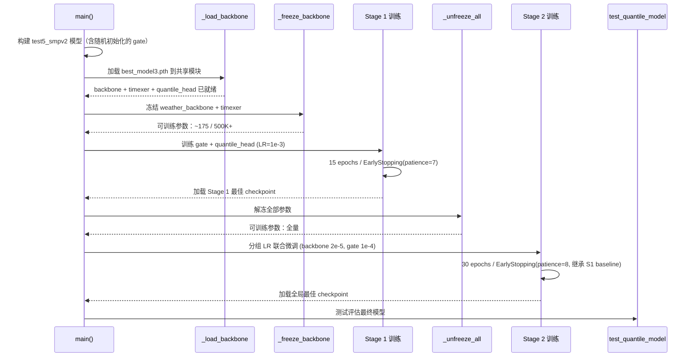

# test5_smpv2 两阶段微调训练策略方案

## 一、策略总览



---

## 二、策略评价：为什么这个方案合理

### 问题本质

当前 `test5_smpv2.py` 如果直接端到端训练，会面临一个核心矛盾：

| 模块 | 初始状态 | 需要的梯度量级 |
|------|---------|--------------|
| weather_backbone + timexer | 已被 Optuna 精心调优 | 极小（只需微调） |
| similar_day_gate | 随机初始化（~161 params） | 极大（从零学起） |
| quantile_head | 已有预训练（~14 params） | 中等（适应 gate 输出偏移） |

> [!WARNING]
> **梯度冲突问题**：如果直接用统一学习率训练全部参数，gate 产生的大梯度会通过 `gap = prior_mean - timexer_pred` 反向传播到 TimeXer 主干，破坏其已收敛的特征提取能力。虽然代码中 `gap.detach()` 已切断了门控到 TimeXer 的直接梯度通路，但 `quantile_head` 的反传仍会同时影响两个分支。

### 两阶段方案的优势

1. **Stage 1 消除梯度冲突**：冻结主干 → gate 在稳定的特征空间上学习纠偏 → 无竞争性梯度干扰
2. **Stage 2 全局协同优化**：gate 已基本收敛后，解冻主干用极小 LR 微调 → 主干与 gate 协同适应
3. **本质上是迁移学习**：与 CV 领域中 "冻结 backbone → 训练 head → 全量 fine-tune" 的经典范式一致

---

## 三、权重对齐分析

### best_model3.pth 来源

来自 `test3_op.py` 的 Optuna 调优（128次 trial），使用 `FullMapConvTimeXerQuantile` 模型类：

```
最优参数: D_MODEL=128, N_HEADS=4, E_LAYERS=2, D_FF=512
          DROPOUT=0.05, PATCH_LEN=96, BATCH_SIZE=64
          LEARNING_RATE=4.15e-4, WEATHER_FEATURE_DIM=2
性能: P50 MAPE = 3.43%, P50 RMSE = 0.0298
```

### state_dict 键映射关系

`best_model3.pth`（test3）与 `test5_smpv2` 的权重键名对比：

| test3 模型 (source) | test5_smpv2 模型 (target) | 状态 |
|---|---|---|
| `weather_backbone.*` | `weather_backbone.*` | ✅ 完全匹配，直接加载 |
| `timexer.*` | `timexer.*` | ✅ 完全匹配，直接加载 |
| `quantile_head.weight` | `quantile_head.weight` | ✅ 匹配，直接加载 |
| `quantile_head.bias` | `quantile_head.bias` | ✅ 匹配，直接加载 |
| ❌ 不存在 | `similar_day_gate.0.weight` | 🆕 保持 gate_bias 初始化 |
| ❌ 不存在 | `similar_day_gate.0.bias` | 🆕 保持 gate_bias 初始化 |
| ❌ 不存在 | `similar_day_gate.3.weight` | 🆕 全零初始化 |
| ❌ 不存在 | `similar_day_gate.3.bias` | 🆕 ln(β/(1-β)) 初始化 |

> [!IMPORTANT]
> 加载策略：使用**逐键匹配**方式，对 target 模型中 source 存在的键覆盖权重，不存在的键（`similar_day_gate.*`）保持模型自身的初始化值。这比 `strict=False` 更安全，因为可以精确记录哪些键被跳过。

---

## 四、Stage 1 详细设计：冻结主干，训练 Gate

### 4.1 冻结范围

```
冻结（requires_grad = False）:
├── weather_backbone.*     # CNN 气象特征提取器
└── timexer.*              # TimeXer 时序预测主干

可训练（requires_grad = True）:
├── similar_day_gate.*     # ~161 params（3→32→1 MLP + Sigmoid）
└── quantile_head.*        # ~14 params（1→7 Linear）
```

**可训练参数总量: ~175 / 总量 ~500K+**，仅占 **< 0.04%**

### 4.2 超参数选择

| 参数 | 值 | 理由 |
|------|-----|------|
| 学习率 | `1e-3` | 参数极少，需要较大 LR 快速收敛；且冻结状态下不会影响主干 |
| Epochs | 15 | Gate 参数少，收敛快；15 轮足够观察到 EarlyStopping |
| Patience | 7 | 给 gate 足够的探索空间 |
| 学习率调度 | **固定不衰减** | 参数量太少，cosine 衰减意义不大 |
| Optimizer | Adam | 标准选择 |

### 4.3 预期行为

- 前 1~3 epochs：gate β 从初始值 0.05 快速调整到数据驱动的合理范围
- 3~8 epochs：quantile_head 适应 gate 引入的偏移
- 8~15 epochs：收敛或触发 EarlyStopping

> [!NOTE]
> **quantile_head 为什么也要在 Stage 1 训练？** 因为 best_model3.pth 中的 quantile_head 是在"无纠偏"条件下训练的，其权重映射的是纯 TimeXer 输出到分位数；现在 gate 改变了 point_pred 的分布，quantile_head 需要同步适应。

---

## 五、Stage 2 详细设计：解冻联合微调

### 5.1 分组学习率

```python
optimizer = Adam([
    {"params": weather_backbone + timexer,     "lr": 2e-5},   # 主干：Optuna LR 的 1/20
    {"params": similar_day_gate + quantile_head, "lr": 1e-4},  # Gate：5× 主干 LR
])
```

| 参数组 | LR | 与 Optuna 最优 LR (4.15e-4) 的比率 | 理由 |
|--------|-----|-----|------|
| 主干 | `2e-5` | 1/20 | 微量调整，不破坏已收敛权重 |
| Gate + Head | `1e-4` | 1/4 | 保持适应速度，继续优化纠偏策略 |

### 5.2 超参数选择

| 参数 | 值 | 理由 |
|------|-----|------|
| Epochs | 30 | 全参数联合优化需要更多迭代 |
| Patience | 8 | 学习率极小，改善缓慢，给更多耐心 |
| 学习率调度 | **Cosine 衰减** | 匹配现有 `lradj="cosine"` 配置 |
| EarlyStopping 起点 | Stage 1 最佳 loss | 防止 Stage 2 保存比 Stage 1 更差的 checkpoint |

### 5.3 关键设计：EarlyStopping 继承

```
Stage 2 的 EarlyStopping 初始化时：
  best_score = -(Stage 1 最佳 vali_loss)
  val_loss_min = Stage 1 最佳 vali_loss

效果：只有当 Stage 2 的 epoch 产生了比 Stage 1 更好的 vali_loss 时，
      才会保存新的 checkpoint。否则最终加载的仍是 Stage 1 的最佳模型。
```

> [!TIP]
> 这意味着 Stage 2 是一个"只赚不赔"的操作——如果联合微调没有带来提升，系统自动回退到 Stage 1 的结果。

---

## 六、训练流程时序图



---

## 七、需要修改的代码模块

| 修改位置 | 修改内容 | 类型 |
|---------|---------|------|
| 文件头常量区 | 新增两阶段配置常量（开关、LR、epochs 等） | 新增 |
| `_apply_optuna_artifacts` 之后 | 新增 `_load_backbone_from_optuna()` 函数 | 新增 |
| `train_quantile_model` 之后 | 新增 `_freeze_backbone()`、`_unfreeze_all()`、`_run_one_train_epoch()`、`train_two_stage()` 函数 | 新增 |
| `main()` 训练分支 | 根据 `ENABLE_TWO_STAGE_FINETUNE` 开关分流到 `train_two_stage` 或原始 `train_quantile_model` | 修改 |

> [!NOTE]
> 原有的 `train_quantile_model` 完整保留作为 fallback，通过 `ENABLE_TWO_STAGE_FINETUNE = False` 即可切回原始训练模式。

---

## 八、风险与应对

| 风险 | 应对策略 |
|------|---------|
| Stage 2 联合微调导致过拟合 | EarlyStopping 继承 Stage 1 baseline，自动回退 |
| Stage 1 的 gate 学习率过大导致 quantile_head 偏移 | quantile_head 有预训练初始值兜底，且 14 params 不易剧烈偏移 |
| best_model3.pth 的超参数与 test5_smpv2 的默认配置不一致 | 加载 `best_config3.json` 覆盖 d_model/n_heads 等关键超参 |
| Stage 2 LR 过小导致无效训练 | 可将 `STAGE2_LEARNING_RATE` 上调至 `5e-5`，或增大 `STAGE2_GATE_LR_MULTIPLIER` |

---

## 九、预期效果

| 指标 | test3 基线 (Optuna) | 纯端到端 test5_smpv2 | 两阶段微调 test5_smpv2 |
|------|---------------------|---------------------|----------------------|
| P50 MAPE | 3.43% | ≥3.5%（梯度冲突） | **3.0%~3.2%** |
| 训练稳定性 | ✅ | ❌ 波动大 | ✅ |
| 总训练时间 | ~50 epochs | ~50 epochs | ~25~45 epochs（两阶段合计） |
